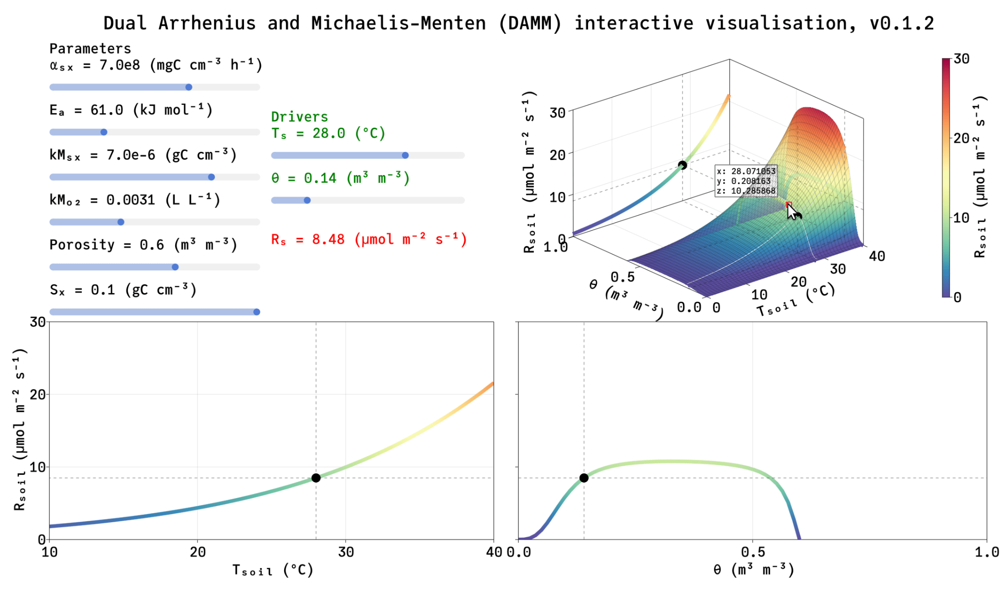

# Summary

Current climate change is mostly the result of increasing atmospheric greenhouse
gases concentration, particularly carbon dioxide (CO~2~). The land has
been absorbing about a third of anthropogenic CO~2~ emissions, but this may change.
Earth System Models attempts to predict future climate, accounting for feedbacks, 
including how the land will respond. The Dual Arrhenius and Michaelis-Menten
(DAMM) kinetics model is a semi-mechanistic model of heterotrophic respiration 
[@Davidson:2012], it estimates respiration as a response to soil temperature and
soil moisture. This model can be applied at various scales by empiricists and modelers
to better understand respiration. 

# Statement of need

`DAMMmodel` is a Julia package providing functions to use, parameterize, and visualize
the DAMM model, using the Makie.jl package [@DanischKrumbiegel2021]. The Julia programming language
is particularly adequate, as empiricists require simple synthax, and modelers require speed.
`DAMMmodel` may be directly used from Earth System Models as a module, and by empiricists 
to parameterize the model to their data and visualize the results. It may also be used for teaching. 
\autoref{fig:example}

# Acknowledgements

We acknowledge the support of Roser Matamala, Pamela Weisenhorn and Rao Kotamarthi for
this project, as well as the help from the Makie.jl community.

# References
